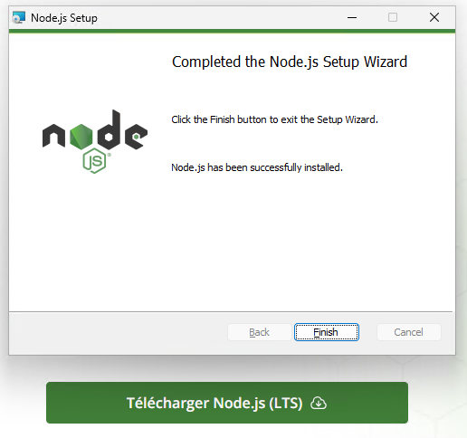
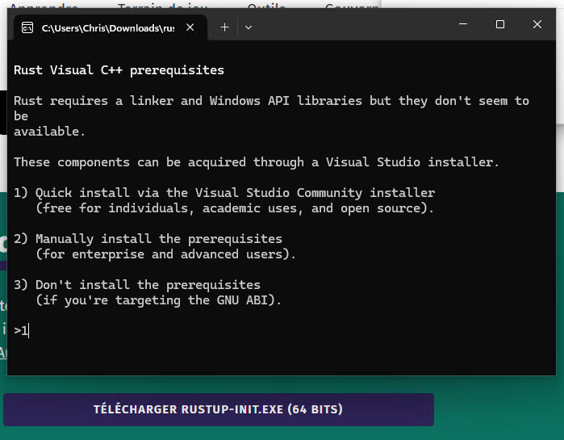

# TracerDesigner

**A propos**

Tracer Designer est un outil conçu pour générer les coordonnées des formes et des textes destinés à la solution de monitoring IVTRACER. Il repose sur le logiciel SVGEDIT (https://github.com/SVG-Edit/svgedit) et TAURI 2 (https://v2.tauri.app/fr/).  

Cette solution peut également être utilisée via un serveur Node.js.

# *Caractéristiques*

Tracer Designer est une application autonome compatible avec Windows, macOS et Linux. Développée avec Tauri, elle offre des performances optimisées tout en consommant un minimum de ressources.

# *Installation*

Vous pouvez trouver une version exécutable sur le releases.

# *Version Web*
	Sous Linux Alpine.

	Taper la commande apk add npm pour installer npm
	Taper la commande apk add git pour installer git

1. Cloner ou copier le contenu du référentiel depuis github: git clone https://github.com/christophe94700/TracerDesigner.git
1. Exécuter npm i pour installer les dépendances
1. Exécuter npm run dev
1. pour tester, vous pouvez exécuter npm run startpour démarrer un serveur local et accéder http://localhost:8000/src/editor/index.html avec un navigateur pris en charge exécutez npm run buildpour créer un bundle que vous pouvez servir à partir de votre propre serveur Web

# *Construire les fichiers EXE*

***Prérequis***

**Node.js** https://nodejs.org/fr (pour construire le projet)

**Rust** https://www.rust-lang.org/tools/install (pour construire le backend Tauri)

**git** https://gitforwindows.org/

**Création de l'application**

Cloner les fichiers sources.

	git clone https://github.com/christophe94700/TracerDesigner.git

	cd TracerDesigner
	
	npm install

Créer l'application

	npm run tauri build
